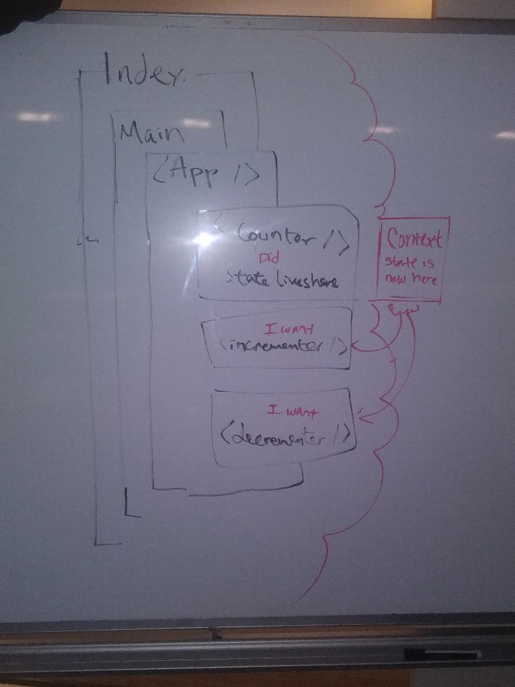

# LAB - 33

## Context Practice

### Author: Joseph Hangarter; mobbed with class

### Links and Resources
* [submission PR]()

### Modules
#### `index.js` - entry point
#### `app.js` - imported to `index.js`; renders to page
#### `counter.js` - imported to `app.js`; returns counter
#### `incrementer.js` - imported to `app.js`; increments when `+` is clicked
#### `decrementer.js` - imported to `app.js`; decrements when `-` is clicked
#### `context.js` - imported to `index.js`, `counter.js`, `incrementer.js`, & `decrementer.js` with increment & decrement function

##### Exported Values and Methods

###### `incrementCounter() -> number + 1`
increments when `+` is clicked

###### `decrementCounter() -> number - 1`
decrements when `-` is clicked

#### Running the app
* `npm start`
  
#### UML

